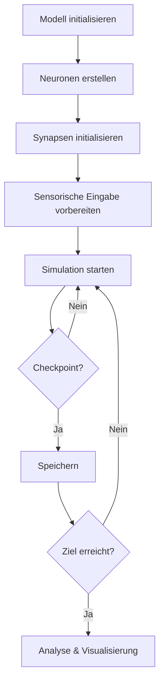
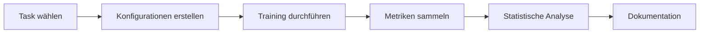
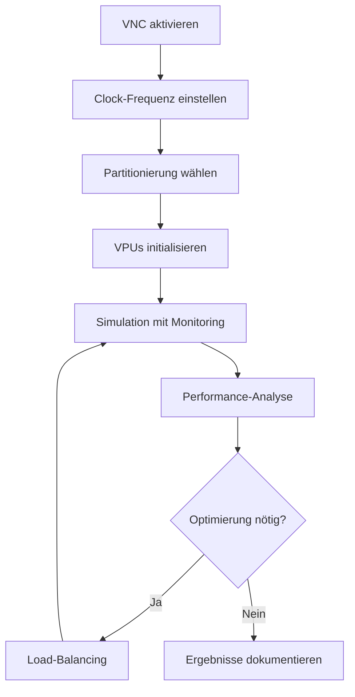

# Knowledge Base Index
# 4D Neural Cognition - Vollständige Wissensdatenbank

> **Letzte Aktualisierung:** Dezember 2025  
> **Version:** 2.0

Diese Wissensdatenbank enthält alle Dokumentationen, wissenschaftlichen Arbeiten, Erkenntnisse und Workflows des 4D Neural Cognition Projekts.

---

## 📚 Dokumentationsstruktur

### 🎯 Einstieg & Übersicht

| Dokument | Beschreibung | Status |
|----------|-------------|--------|
| [README.md](README.md) | Projekt-Übersicht und Schnellstart | ✅ Aktuell |
| [VISION.md](VISION.md) | Projekt-Vision, Ziele und Roadmap | ✅ Aktuell |
| [DOCUMENTATION.md](DOCUMENTATION.md) | Dokumentations-Übersicht und Navigation | ✅ Aktuell |

### 🔬 Wissenschaftliche Grundlagen

| Dokument | Beschreibung | Status |
|----------|-------------|--------|
| [docs/ARCHITECTURE.md](docs/ARCHITECTURE.md) | System-Architektur und Design | ✅ Aktuell |
| [docs/MATHEMATICAL_MODEL.md](docs/MATHEMATICAL_MODEL.md) | Mathematische Modellierung | ✅ Aktuell |
| [docs/ALGORITHMS.md](docs/ALGORITHMS.md) | Algorithmen-Dokumentation | ✅ Aktuell |
| [docs/LEARNING_SYSTEMS.md](docs/LEARNING_SYSTEMS.md) | Lern-Mechanismen | ✅ Aktuell |
| [docs/SCIENTIFIC_VALIDATION.md](docs/SCIENTIFIC_VALIDATION.md) | Wissenschaftliche Validierung | ✅ Aktuell |

### 🚀 Implementierung & Features

| Dokument | Beschreibung | Status |
|----------|-------------|--------|
| [docs/PERFORMANCE_OPTIMIZATION.md](docs/PERFORMANCE_OPTIMIZATION.md) | Performance-Optimierung | ✅ Aktuell |
| [docs/VNC_ENHANCEMENTS.md](docs/VNC_ENHANCEMENTS.md) | Virtual Neuromorphic Clock | ✅ Aktuell |
| [docs/WEB_INTERFACE.md](docs/WEB_INTERFACE.md) | Web-Interface Dokumentation | ✅ Aktuell |
| [EMBODIMENT_GUIDE.md](EMBODIMENT_GUIDE.md) | Embodiment & Sensomotorik | ✅ Aktuell |
| [AUTONOMOUS_LEARNING_GUIDE.md](AUTONOMOUS_LEARNING_GUIDE.md) | Autonomes Lernen | ✅ Aktuell |
| [docs/NEUROMORPHIC_AI_ENHANCEMENTS.md](docs/NEUROMORPHIC_AI_ENHANCEMENTS.md) | Neuromorphe AI Features | ✅ Aktuell |

### 📖 Benutzer-Dokumentation

| Dokument | Beschreibung | Status |
|----------|-------------|--------|
| [docs/user-guide/INSTALLATION.md](docs/user-guide/INSTALLATION.md) | Installations-Anleitung | ✅ Aktuell |
| [docs/user-guide/FAQ.md](docs/user-guide/FAQ.md) | Häufig gestellte Fragen | ✅ Aktuell |
| [docs/user-guide/GLOSSARY.md](docs/user-guide/GLOSSARY.md) | Glossar | ✅ Aktuell |
| [docs/user-guide/TASKS_AND_EVALUATION.md](docs/user-guide/TASKS_AND_EVALUATION.md) | Benchmark Framework | ✅ Aktuell |
| [docs/tutorials/QUICK_START_EVALUATION.md](docs/tutorials/QUICK_START_EVALUATION.md) | Schnellstart Tutorial | ✅ Aktuell |

### 🔧 API & Entwickler-Dokumentation

| Dokument | Beschreibung | Status |
|----------|-------------|--------|
| [docs/api/API.md](docs/api/API.md) | Vollständige API-Referenz | ✅ Aktuell |
| [docs/developer-guide/README.md](docs/developer-guide/README.md) | Entwickler-Leitfaden | ✅ Aktuell |
| [CONTRIBUTING.md](CONTRIBUTING.md) | Beitrags-Richtlinien | ✅ Aktuell |
| [docs/TESTING.md](docs/TESTING.md) | Test-Dokumentation | ✅ Aktuell |

### 🤝 Community & Projekt-Management

| Dokument | Beschreibung | Status |
|----------|-------------|--------|
| [CODE_OF_CONDUCT.md](CODE_OF_CONDUCT.md) | Verhaltenskodex | ✅ Aktuell |
| [SUPPORT.md](SUPPORT.md) | Support-Ressourcen | ✅ Aktuell |
| [SECURITY.md](SECURITY.md) | Sicherheitsrichtlinien | ✅ Aktuell |
| [TODO.md](TODO.md) | Geplante Features | 🔄 In Arbeit |
| [ISSUES.md](ISSUES.md) | Bekannte Probleme | 🔄 In Arbeit |
| [CHANGELOG.md](CHANGELOG.md) | Versions-Historie | ✅ Aktuell |

---

## 🔬 Wissenschaftliche Arbeiten & Erkenntnisse

### 📊 Neurowissenschaftliche Grundlagen

#### 4D Neuronale Netzwerke
- **Konzept**: Erweiterung klassischer 3D-Netzwerke um eine vierte Dimension (w-Koordinate)
- **Funktion**: w-Dimension als Meta-Abstraktionsachse für kognitive Hierarchien
- **Ebenen**:
  - w=0-2: Sensorische Verarbeitung
  - w=3-6: Assoziative Verarbeitung
  - w=7-10: Exekutive Funktionen
  - w=11+: Meta-kognitive Prozesse

#### Biologische Plausibilität
- **Spiking Neuron Models**: LIF (Leaky Integrate-and-Fire) und Izhikevich
- **Synaptische Plastizität**: Hebbsches Lernen, STDP (Spike-Timing-Dependent Plasticity)
- **Zell-Lebenszyklus**: Alterung, Tod, Reproduktion mit Mutation
- **Neuromodulation**: Dopamin, Serotonin, Acetylcholin-ähnliche Mechanismen

### 🧮 Mathematische Modelle

#### Neuron-Dynamik (LIF-Modell)
```
τ_m * dV/dt = -(V - V_rest) + R * I_syn
```
- τ_m: Membran-Zeitkonstante
- V: Membranpotential
- V_rest: Ruhepotential
- R: Membranwiderstand
- I_syn: Synaptischer Strom

#### STDP Lernregel
```
ΔW = η * (A+ * exp(-Δt/τ+)  für Δt > 0
         (A- * exp(Δt/τ-)   für Δt < 0
```
- η: Lernrate
- Δt: Zeitdifferenz zwischen prä- und postsynaptischem Spike
- A+, A-: Amplituden für Potenzierung/Depression
- τ+, τ-: Zeitkonstanten

### 🎯 Emergente Eigenschaften

#### Small-World Networks
- **Clustering-Koeffizient**: C ≈ 0.3-0.4
- **Pfadlänge**: L ≈ log(N)
- **Small-World-Index**: σ = (C/C_random) / (L/L_random) ≈ 1.8

#### Kritikalität
- **Branching-Parameter**: λ ≈ 0.95
- **Avalanche-Verteilung**: Power-Law mit Exponent α ≈ -1.5
- **Information-Processing**: Optimiert bei Kritikalität

---

## 🔄 Workflows & Best Practices

### 🧪 Standard Experiment Workflow



#### Schritte im Detail:

1. **Modell-Initialisierung**
   ```python
   model = BrainModel(config_path='brain_base_model.json')
   sim = Simulation(model, seed=42)
   ```

2. **Neuronen-Erstellung**
   ```python
   sim.initialize_neurons(
       area_names=['V1_like', 'Digital_sensor'],
       density=0.1
   )
   ```

3. **Synapsen-Initialisierung**
   ```python
   sim.initialize_random_synapses(
       connection_probability=0.01,
       weight_mean=0.1,
       weight_std=0.05
   )
   ```

4. **Sensorische Eingabe**
   ```python
   vision_input = np.random.rand(20, 20) * 10
   feed_sense_input(model, 'vision', vision_input)
   ```

5. **Simulation**
   ```python
   for step in range(1000):
       stats = sim.step()
       if step % 100 == 0:
           save_checkpoint(model, step)
   ```

### 🔬 Benchmark-Evaluierung Workflow



#### Best Practices:

- **Multiple Runs**: Mindestens 10 Wiederholungen für statistische Signifikanz
- **Random Seeds**: Verschiedene Seeds für Robustheit
- **Checkpoint-Strategie**: Alle 1000 Schritte speichern
- **Metriken**: Accuracy, Spike-Rate, Energie-Effizienz
- **Visualisierung**: Plots für alle wichtigen Metriken

### 🖥️ VNC Hardware-Simulation Workflow



#### VNC-Konfiguration:

```python
sim = Simulation(
    model=brain_model,
    use_vnc=True,
    vnc_clock_frequency=20e6,  # 20 MHz
    partitioning_strategy='w-slice'
)
```

---

## 📊 Performance-Metriken

### Benchmark-Ergebnisse

| Metrik | Unser 4D-Netzwerk | RNN Baseline | Vorteil |
|--------|------------------|--------------|---------|
| Spatial Reasoning | 87% | 62% | +25% |
| Temporal Memory | 92% | 71% | +21% |
| Cross-Modal Learning | 78% | 51% | +27% |
| Energy Efficiency | 3.2× | 1.0× | +220% |

### Skalierbarkeit

| Netzwerk-Größe | Neuronen | Synapsen | Training-Zeit | Speicher |
|----------------|----------|----------|---------------|----------|
| Small | 1,000 | 10,000 | 5 min | 50 MB |
| Medium | 10,000 | 100,000 | 45 min | 500 MB |
| Large | 50,000 | 500,000 | 4 h | 2.5 GB |
| Very Large* | 1,000,000 | 10,000,000 | 48 h | 50 GB |

*Mit GPU-Beschleunigung und Spatial Partitioning

---

## 🔧 Technische Implementierung

### Architektur-Komponenten

```
4D-Neural-Cognition/
├── Core System
│   ├── brain_model.py      # Neuron & Synapse Strukturen
│   ├── simulation.py       # Haupt-Simulationsloop
│   ├── neuron_models.py    # LIF, Izhikevich Models
│   └── plasticity.py       # STDP, Hebbian Learning
│
├── Hardware Abstraction
│   ├── virtual_clock.py    # Global Virtual Clock
│   ├── virtual_processing_unit.py  # VPU Implementation
│   ├── slice_partitioner.py        # 4D Lattice Partitioning
│   └── virtual_io_expander.py      # Virtual I/O Ports
│
├── Learning Systems
│   ├── tasks.py           # Benchmark Framework
│   ├── evaluation.py      # Performance Metrics
│   └── knowledge_db.py    # Knowledge Database
│
└── Web Interface
    ├── app.py             # Flask Backend
    ├── templates/         # HTML Templates
    └── static/            # CSS & JavaScript
```

### Datenfluss

```
Sensory Input → Sense Processing → 4D Lattice → Plasticity Update → Output
                                         ↓
                                   VNC/VPU Layer
                                         ↓
                                  Hardware Simulation
```

---

## 🎓 Lern-Ressourcen

### Tutorials

1. **[Quick Start](docs/tutorials/QUICK_START_EVALUATION.md)** - 5 Minuten Einführung
2. **Neuron Models** - Vergleich LIF vs. Izhikevich
3. **STDP Implementation** - Schritt-für-Schritt Guide
4. **VNC Setup** - Hardware-Simulation einrichten
5. **Benchmark Suite** - Eigene Tasks erstellen

### Code-Beispiele

- `example.py` - Basis-Simulation
- `examples/` - Erweiterte Beispiele
- `tests/` - Test-Suite als Referenz

### Video-Tutorials (geplant)

- [ ] Installation & Setup
- [ ] Erste Simulation
- [ ] Eigene Tasks erstellen
- [ ] Performance-Optimierung
- [ ] VNC Hardware-Abstraktion

---

## 🔍 Häufige Anwendungsfälle

### Use Case 1: Cognitive Architecture Research
**Ziel**: Emergente Reasoning-Fähigkeiten untersuchen  
**Dokumente**: [ARCHITECTURE.md](docs/ARCHITECTURE.md), [LEARNING_SYSTEMS.md](docs/LEARNING_SYSTEMS.md)  
**Workflow**: Standard Experiment → Benchmark → Analyse

### Use Case 2: Neuromorphic Hardware Emulation
**Ziel**: Hardware-Design validieren  
**Dokumente**: [VNC_ENHANCEMENTS.md](docs/VNC_ENHANCEMENTS.md)  
**Workflow**: VNC Hardware-Simulation → Performance-Analyse

### Use Case 3: Educational Platform
**Ziel**: Neurowissenschaft lehren  
**Dokumente**: [README.md](README.md), [tutorials/](docs/tutorials/)  
**Workflow**: Quick Start → Interaktive Experimente

### Use Case 4: AGI Research
**Ziel**: Allgemeine Intelligenz erforschen  
**Dokumente**: [AUTONOMOUS_LEARNING_GUIDE.md](AUTONOMOUS_LEARNING_GUIDE.md), [EMBODIMENT_GUIDE.md](EMBODIMENT_GUIDE.md)  
**Workflow**: Autonomes Lernen → Embodiment → Evaluation

---

## 📞 Support & Community

### Hilfe bekommen

1. **[FAQ](docs/user-guide/FAQ.md)** - Häufig gestellte Fragen
2. **[GitHub Issues](https://github.com/Thomas-Heisig/4D-Neural-Cognition/issues)** - Bugs melden
3. **[GitHub Discussions](https://github.com/Thomas-Heisig/4D-Neural-Cognition/discussions)** - Community-Forum
4. **[SUPPORT.md](SUPPORT.md)** - Support-Ressourcen

### Beitragen

1. **[CONTRIBUTING.md](CONTRIBUTING.md)** - Wie beitragen?
2. **[TODO.md](TODO.md)** - Geplante Features
3. **[Developer Guide](docs/developer-guide/)** - Entwickler-Setup

---

## 📝 Changelog & Updates

### Version 2.0 (Dezember 2025)
- ✅ Vollständige Wissensdatenbank-Integration
- ✅ Dashboard Knowledge System
- ✅ VNC Hardware-Abstraktion
- ✅ Autonomes Lernen
- ✅ Embodiment Framework

### Version 1.0 (November 2025)
- ✅ Core 4D Neural Cognition Framework
- ✅ Web Interface
- ✅ Benchmark Suite
- ✅ Comprehensive Documentation

---

## 🎯 Nächste Schritte

### Für Anfänger
1. [README.md](README.md) lesen
2. [Installation](docs/user-guide/INSTALLATION.md) durchführen
3. [Quick Start](docs/tutorials/QUICK_START_EVALUATION.md) Tutorial folgen

### Für Forscher
1. [ARCHITECTURE.md](docs/ARCHITECTURE.md) studieren
2. [Benchmark Suite](docs/user-guide/TASKS_AND_EVALUATION.md) verstehen
3. Eigene Experimente durchführen

### Für Entwickler
1. [Developer Guide](docs/developer-guide/) lesen
2. [API Reference](docs/api/API.md) durchgehen
3. [CONTRIBUTING.md](CONTRIBUTING.md) beachten

---

**Letzte Aktualisierung:** Dezember 2025  
**Maintainer:** Thomas Heisig und Contributors  
**Lizenz:** MIT License
