# Workflows & Prozesse
# 4D Neural Cognition - Workflows und Best Practices

> **Letzte Aktualisierung:** Dezember 2025  
> **Version:** 1.0

Diese Dokumentation beschreibt bewährte Workflows und Prozesse für die Arbeit mit dem 4D Neural Cognition Framework.

---

## 📋 Inhaltsverzeichnis

1. [Experimentelle Workflows](#experimentelle-workflows)
2. [Forschungs-Workflows](#forschungs-workflows)
3. [Entwicklungs-Workflows](#entwicklungs-workflows)
4. [Best Practices](#best-practices)
5. [Troubleshooting](#troubleshooting)

---

## 🧪 Experimentelle Workflows

### 1. Standard Simulationsablauf

**Ziel**: Eine grundlegende Simulation durchführen


#### Schritte im Detail:

**1. Modell initialisieren**
```python
from src.brain_model import BrainModel
from src.simulation import Simulation

# Modell laden
model = BrainModel(config_path='brain_base_model.json')

# Simulation erstellen
sim = Simulation(model, seed=42)
```

**2. Neuronen erstellen**
```python
# Neuronen in spezifischen Arealen erstellen
sim.initialize_neurons(
    area_names=['V1_like', 'Digital_sensor'],
    density=0.1  # 10% der verfügbaren Positionen
)

print(f"Erstellt: {len(model.neurons)} Neuronen")
```

**3. Synapsen initialisieren**
```python
# Zufällige synaptische Verbindungen
sim.initialize_random_synapses(
    connection_probability=0.01,  # 1% Verbindungswahrscheinlichkeit
    weight_mean=0.1,              # Durchschnittliches Gewicht
    weight_std=0.05               # Standardabweichung
)

print(f"Erstellt: {len(model.synapses)} Synapsen")
```

**4. Sensorische Eingabe vorbereiten**
```python
import numpy as np
from src.senses import feed_sense_input, create_digital_sense_input

# Visuelle Eingabe (20x20 Pixe)
vision_input = np.random.rand(20, 20) * 10

# Digitale Eingabe (Text)
digital_input = create_digital_sense_input("Hello, World!", target_shape=(20, 20))
```

**5. Simulation ausführen**
```python
# Simulation Loop
for step in range(1000):
    # Sensorische Eingabe alle 10 Schritte
    if step % 10 == 0:
        feed_sense_input(model, 'vision', vision_input)
        feed_sense_input(model, 'digital', digital_input)
    
    # Einen Schritt simulieren
    stats = sim.step()
    
    # Checkpoint alle 100 Schritte
    if step % 100 == 0:
        print(f"Schritt {step}: {len(stats['spikes'])} Spikes")
    
    # Auto-Checkpoint alle 1000 Schritte
    if step % 1000 == 0 and step > 0:
        from src.storage import save_to_hdf5
        save_to_hdf5(model, f'checkpoints/step_{step}.h5')
```

**6. Ergebnisse analysieren**
```python
# Netzwerk-Statistiken
print(f"Finale Neuronen: {len(model.neurons)}")
print(f"Finale Synapsen: {len(model.synapses)}")
print(f"Aktuelle Schritt: {model.current_step}")

# Durchschnittliches Membranpotential
avg_v = np.mean([n.v_membrane for n in model.neurons.values()])
print(f"Durchschnittliches Membranpotential: {avg_v:.2f} mV")
```

---

### 2. Trainings-Workflow

**Ziel**: Ein Modell trainieren und optimieren


#### Training-Code:

```python
from src.brain_model import BrainModel
from src.simulation import Simulation
from src.storage import save_to_hdf5, load_from_hdf5
import numpy as np

# 1. Modell laden oder neu erstellen
try:
    model = load_from_hdf5('saved_models/latest.h5')
    print("Modell geladen")
except:
    model = BrainModel(config_path='brain_base_model.json')
    print("Neues Modell erstellt")

sim = Simulation(model, seed=42)

# 2. Trainingsdaten
def generate_training_batch(batch_size=10):
    """Generiere Trainingsdaten"""
    inputs = []
    targets = []
    for _ in range(batch_size):
        # Beispiel: Zufällige Muster
        input_pattern = np.random.rand(20, 20) * 10
        target_pattern = input_pattern > 5  # Einfache Klassifikation
        inputs.append(input_pattern)
        targets.append(target_pattern)
    return inputs, targets

# 3. Plastizität konfigurieren
model.config['plasticity']['stdp_enabled'] = True
model.config['plasticity']['hebbian_enabled'] = True
model.config['plasticity']['learning_rate'] = 0.01

# 4. Training Loop
best_accuracy = 0.0
training_history = {
    'accuracy': [],
    'loss': [],
    'spikes': []
}

for epoch in range(100):
    # Trainingsbatch
    inputs, targets = generate_training_batch(batch_size=10)
    
    epoch_spikes = 0
    epoch_accuracy = 0.0
    
    for input_data, target in zip(inputs, targets):
        # Eingabe füttern
        feed_sense_input(model, 'vision', input_data)
        
        # 100 Schritte simulieren
        for step in range(100):
            stats = sim.step()
            epoch_spikes += len(stats['spikes'])
        
        # Validierung (vereinfacht)
        # In echter Implementierung: Ausgabe mit Target vergleichen
        epoch_accuracy += np.random.rand()  # Placeholder
    
    # Durchschnittliche Metriken
    epoch_accuracy /= len(inputs)
    
    # Metriken speichern
    training_history['accuracy'].append(epoch_accuracy)
    training_history['spikes'].append(epoch_spikes)
    
    print(f"Epoch {epoch}: Accuracy={epoch_accuracy:.3f}, Spikes={epoch_spikes}")
    
    # Best Model speichern
    if epoch_accuracy > best_accuracy:
        best_accuracy = epoch_accuracy
        save_to_hdf5(model, 'saved_models/best_model.h5')
        print(f"  → Neues Best Model gespeichert!")
    
    # Regular Checkpoint
    if epoch % 10 == 0:
        save_to_hdf5(model, f'checkpoints/epoch_{epoch}.h5')

# Finales Modell speichern
save_to_hdf5(model, 'saved_models/final_model.h5')
print(f"Training abgeschlossen. Best Accuracy: {best_accuracy:.3f}")
```

---

## 🔬 Forschungs-Workflows

### 3. Benchmark-Evaluierung

**Ziel**: Systematische Leistungsbewertung

```mermaid
graph TD
    A[Start] --> B[Task auswählen]
    B --> C[Mehrere Konfigurationen erstellen]
    C --> D[Für jede Konfiguration]
    D --> E[Multiple Runs mit verschiedenen Seeds]
    E --> F[Metriken sammeln]
    F --> G[Statistische Analyse]
    G --> H[Visualisierung erstellen]
    H --> I[Ergebnisse dokumentieren]
    I --> J{Weitere Configs?}
    J -->|Ja| D
    J -->|Nein| K[Vergleichsreport erstellen]
    K --> L[Ende]
```



#### Benchmark-Code:

```python
from src.tasks import Task, TaskRunner
from src.evaluation import evaluate_performance
import json

# Task definieren
task_config = {
    'name': 'spatial_reasoning',
    'description': 'Finde verstecktes Objekt im Grid',
    'input_size': (20, 20),
    'output_size': 10,
    'trials': 100
}

# Verschiedene Konfigurationen testen
configs = [
    {'density': 0.05, 'connection_prob': 0.005, 'learning_rate': 0.01},
    {'density': 0.10, 'connection_prob': 0.010, 'learning_rate': 0.01},
    {'density': 0.15, 'connection_prob': 0.015, 'learning_rate': 0.01},
]

results = []

for config_idx, config in enumerate(configs):
    print(f"\nTeste Konfiguration {config_idx + 1}/{len(configs)}")
    
    # Multiple runs mit verschiedenen seeds
    config_results = []
    for seed in range(10):
        # Modell erstellen
        model = BrainModel(config_path='brain_base_model.json')
        sim = Simulation(model, seed=seed)
        
        # Neuronen und Synapsen mit Config-Parametern
        sim.initialize_neurons(
            area_names=['V1_like', 'Digital_sensor'],
            density=config['density']
        )
        sim.initialize_random_synapses(
            connection_probability=config['connection_prob']
        )
        
        # Task ausführen
        task_runner = TaskRunner(model, sim, task_config)
        metrics = task_runner.run()
        
        config_results.append(metrics)
        print(f"  Seed {seed}: Accuracy={metrics['accuracy']:.3f}")
    
    # Aggregierte Statistiken
    avg_accuracy = np.mean([r['accuracy'] for r in config_results])
    std_accuracy = np.std([r['accuracy'] for r in config_results])
    
    results.append({
        'config': config,
        'avg_accuracy': avg_accuracy,
        'std_accuracy': std_accuracy,
        'runs': config_results
    })
    
    print(f"  → Durchschnitt: {avg_accuracy:.3f} ± {std_accuracy:.3f}")

# Ergebnisse speichern
with open('benchmark_results.json', 'w') as f:
    json.dump(results, f, indent=2)

# Best Config finden
best_config = max(results, key=lambda x: x['avg_accuracy'])
print(f"\nBeste Konfiguration:")
print(f"  {best_config['config']}")
print(f"  Accuracy: {best_config['avg_accuracy']:.3f} ± {best_config['std_accuracy']:.3f}")
```

---

### 4. VNC Hardware-Test Workflow

**Ziel**: Neuromorphic Hardware simulieren und evaluieren

```mermaid
graph TD
    A[Start] --> B[VNC aktivieren]
    B --> C[Clock-Frequenz konfigurieren]
    C --> D[Partitionierungsstrategie wählen]
    D --> E[VPUs initialisieren]
    E --> F[Monitoring starten]
    F --> G[Simulation durchführen]
    G --> H[Performance-Metriken sammeln]
    H --> I[Load-Balancing analysieren]
    I --> J{Optimierung nötig?}
    J -->|Ja| K[Partitionierung anpassen]
    K --> E
    J -->|Nein| L[Ergebnisse dokumentieren]
    L --> M[Ende]
```



#### VNC-Test Code:

```python
from src.simulation import Simulation
from src.brain_model import BrainModel

# Verschiedene Clock-Frequenzen testen
frequencies = [1e6, 10e6, 20e6, 50e6, 100e6]  # 1MHz bis 100MHz

results = {}

for freq in frequencies:
    print(f"\nTeste Clock-Frequenz: {freq/1e6:.1f} MHz")
    
    # Modell erstellen
    model = BrainModel(config_path='brain_base_model.json')
    
    # VNC-Simulation
    sim = Simulation(
        model,
        seed=42,
        use_vnc=True,
        vnc_clock_frequency=freq,
        partitioning_strategy='w-slice'
    )
    
    # Netzwerk aufbauen
    sim.initialize_neurons(area_names=['V1_like'], density=0.1)
    sim.initialize_random_synapses(connection_probability=0.01)
    
    # Simulation mit Monitoring
    import time
    start_time = time.time()
    
    for step in range(1000):
        sim.step()
    
    elapsed_time = time.time() - start_time
    
    # VNC Statistiken
    vnc_stats = sim.get_vnc_statistics()
    vpu_stats = sim.get_vpu_statistics()
    
    results[freq] = {
        'elapsed_time': elapsed_time,
        'steps_per_second': 1000 / elapsed_time,
        'vnc_stats': vnc_stats,
        'vpu_stats': vpu_stats
    }
    
    print(f"  Zeit: {elapsed_time:.2f}s")
    print(f"  Schritte/s: {results[freq]['steps_per_second']:.1f}")
    print(f"  VPU Auslastung: {vnc_stats['avg_vpu_utilization']:.1%}")

# Beste Frequenz finden
best_freq = max(results.keys(), key=lambda f: results[f]['steps_per_second'])
print(f"\nOptimale Clock-Frequenz: {best_freq/1e6:.1f} MHz")
```

---

## 💻 Entwicklungs-Workflows

### 5. Feature-Entwicklung Workflow

**Ziel**: Neues Feature implementieren

```mermaid
graph TD
    A[Start] --> B[Feature-Branch erstellen]
    B --> C[Tests schreiben]
    C --> D[Feature implementieren]
    D --> E[Tests ausführen]
    E --> F{Tests bestanden?}
    F -->|Nein| G[Debug]
    G --> D
    F -->|Ja| H[Code-Review]
    H --> I[Dokumentation aktualisieren]
    I --> J[Pull Request]
    J --> K[CI/CD Pipeline]
    K --> L{Pipeline erfolgreich?}
    L -->|Nein| G
    L -->|Ja| M[Merge zu main]
    M --> N[Ende]
```



#### Best Practices:

1. **Branch-Naming**: `feature/name`, `bugfix/name`, `docs/name`
2. **Commit-Messages**: Klare, beschreibende Nachrichten
3. **Tests**: Mindestens 80% Code-Coverage
4. **Dokumentation**: Immer zusammen mit Code aktualisieren

---

### 6. Bug-Fix Workflow

```mermaid
graph TD
    A[Bug entdeckt] --> B[Issue erstellen]
    B --> C[Bug reproduzieren]
    C --> D[Test schreiben der Bug zeigt]
    D --> E[Bug fixen]
    E --> F[Test ausführen]
    F --> G{Test bestanden?}
    G -->|Nein| E
    G -->|Ja| H[Regression Tests]
    H --> I[Pull Request]
    I --> J[Review & Merge]
    J --> K[Ende]
```



---

## 📘 Best Practices

### Checkpoint-Strategie

**Empfohlene Intervalle:**
- **Häufig**: Alle 100-1000 Schritte während Training
- **Regelmäßig**: Alle 10 Epochen
- **Best Model**: Immer wenn Validierungs-Metrik verbessert wird

```python
# Checkpoint-Implementierung
def save_checkpoint(model, step, metrics, checkpoint_dir='checkpoints'):
    from pathlib import Path
    import json
    
    checkpoint_dir = Path(checkpoint_dir)
    checkpoint_dir.mkdir(exist_ok=True)
    
    # Modell speichern
    model_path = checkpoint_dir / f'step_{step}.h5'
    save_to_hdf5(model, str(model_path))
    
    # Metriken speichern
    metrics_path = checkpoint_dir / f'step_{step}_metrics.json'
    with open(metrics_path, 'w') as f:
        json.dump(metrics, f, indent=2)
    
    print(f"Checkpoint gespeichert: {model_path}")
```

### Monitoring

**Wichtige Metriken überwachen:**
- Spike-Rate
- Durchschnittliches Membranpotential
- Synapsen-Gewichte
- Neuronen-Gesundheit
- Training-/Validierungs-Loss

```python
def monitor_metrics(model):
    """Sammle wichtige Metriken"""
    neurons = list(model.neurons.values())
    synapses = list(model.synapses)
    
    metrics = {
        'num_neurons': len(neurons),
        'num_synapses': len(synapses),
        'avg_membrane': np.mean([n.v_membrane for n in neurons]),
        'avg_health': np.mean([n.health for n in neurons]),
        'avg_weight': np.mean([s.weight for s in synapses]),
        'current_step': model.current_step
    }
    
    return metrics
```

### Reproduzierbarkeit

**Wichtig für wissenschaftliche Arbeit:**

```python
# 1. Seeds setzen
import random
import numpy as np

def set_seeds(seed=42):
    random.seed(seed)
    np.random.seed(seed)
    # Weitere seeds falls nötig

set_seeds(42)

# 2. Konfiguration dokumentieren
config = {
    'model_config': 'brain_base_model.json',
    'seed': 42,
    'neuron_density': 0.1,
    'connection_probability': 0.01,
    'learning_rate': 0.01
}

# In Datei speichern
with open('experiment_config.json', 'w') as f:
    json.dump(config, f, indent=2)
```

---

## 🔧 Troubleshooting

### Häufige Probleme

#### Problem 1: Zu wenig Spikes
**Symptome**: Netzwerk sehr inaktiv  
**Ursachen**:
- Zu niedrige sensorische Eingabe
- Zu hohe Aktivierungsschwellen
- Zu schwache synaptische Gewichte

**Lösung**:
```python
# Eingabe verstärken
vision_input = np.random.rand(20, 20) * 20  # Erhöht von 10 auf 20

# Schwellwerte senken
model.config['neuron_model']['v_threshold'] = -50  # Von -55

# Gewichte erhöhen
sim.initialize_random_synapses(
    weight_mean=0.2,  # Von 0.1
    weight_std=0.1
)
```

#### Problem 2: Netzwerk wird instabil
**Symptome**: Exponentielles Spike-Wachstum  
**Ursachen**:
- Zu wenig inhibitorische Neuronen
- Zu starke synaptische Gewichte
- Fehlende Refraktärperiode

**Lösung**:
```python
# Mehr inhibitorische Neuronen
model.config['neuron_model']['inhibitory_ratio'] = 0.3  # 30% inhibitorisch

# Gewichte begrenzen
model.config['plasticity']['weight_bounds'] = [-1.0, 1.0]

# Homeostase aktivieren
model.config['plasticity']['homeostatic_enabled'] = True
```

#### Problem 3: Speicherprobleme
**Symptome**: Out of Memory  
**Ursachen**:
- Zu großes Netzwerk
- Zu viele Checkpoints
- Ineffiziente Datenstrukturen

**Lösung**:
```python
# Netzwerk verkleinern
model.config['lattice_shape'] = [10, 10, 10, 10]  # Von [20, 20, 20, 20]

# Alte Checkpoints löschen
from pathlib import Path
checkpoints = sorted(Path('checkpoints').glob('*.h5'))
for old_checkpoint in checkpoints[:-3]:  # Behalte nur letzte 3
    old_checkpoint.unlink()

# HDF5 mit Kompression
save_to_hdf5(model, 'model.h5', compression='gzip')
```

---

## 📚 Weitere Ressourcen

- **[API Reference](docs/api/API.md)** - Vollständige API-Dokumentation
- **[Architecture](docs/ARCHITECTURE.md)** - System-Architektur
- **[FAQ](docs/user-guide/FAQ.md)** - Häufige Fragen
- **[Examples](examples/)** - Code-Beispiele

---

**Letzte Aktualisierung:** Dezember 2025  
**Maintainer:** Thomas Heisig und Contributors  
**Feedback:** Öffne ein Issue auf GitHub
